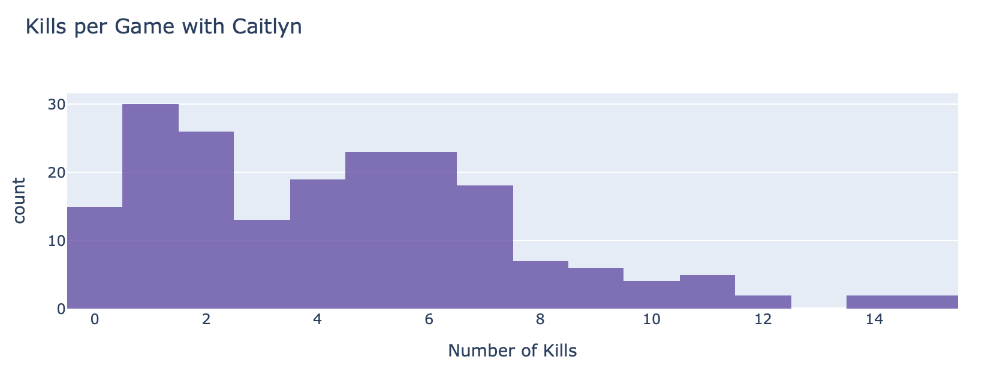
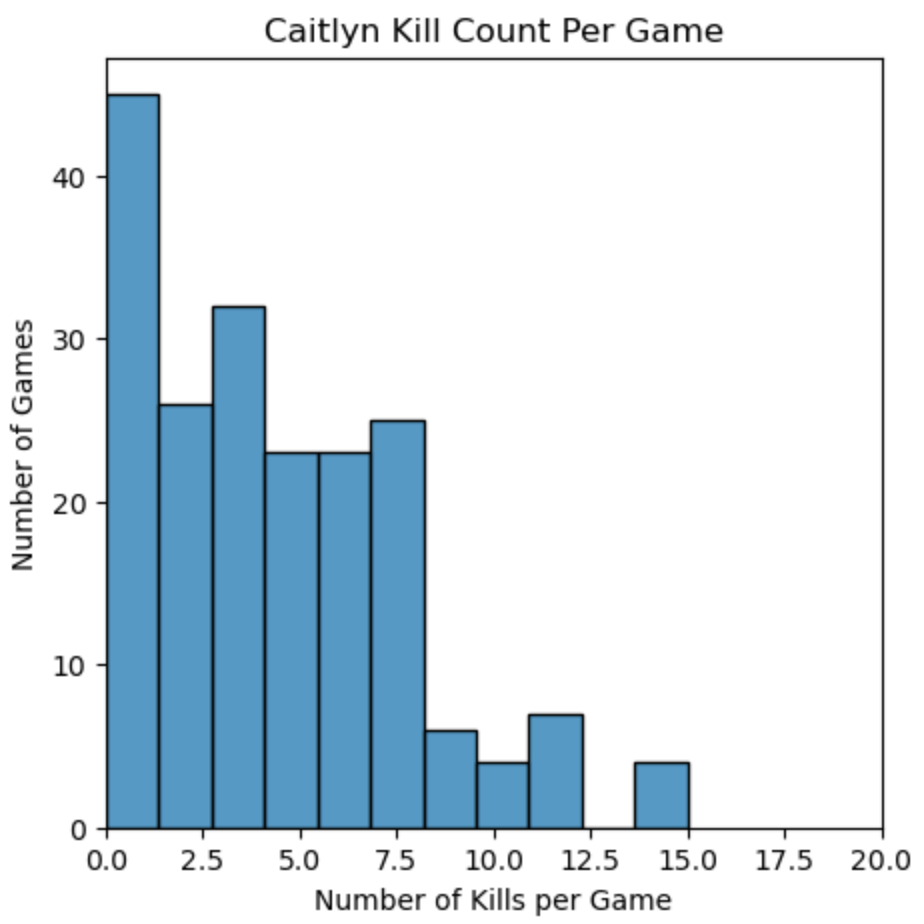
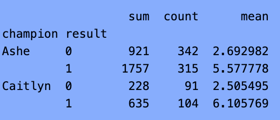
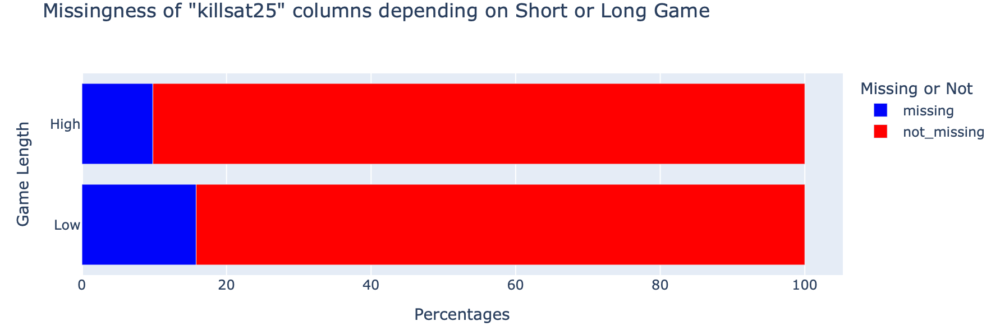

<h1> League of Legends Prediction </h1>

<h2> Introduction </h2>

 League of Legends is a very popular game amongst the younger generation. The top percentile of playes can even make a living off of being good at the game. Naturally, if there is a pattern that can be observed that brings in more wins, we would want to find that out. Is there any pattern between those that choose Ashe versus Caitlyn as their Champion? 

 There are 5 rows in this dataset. We will be exploring the columns 'champion' (tells us the name of the fighter that the user plays as), 'results' (tells us if the game is won or last 1 being a win and 0 being a loss), 'kills', (tells us how many kills the player received per game) 

<h2> Data Cleaning and Exploratory Data Analysis </h2>

 I cleaned the data by filling empty values in the 'kill' column with 0. By doing so, I am able to make use of the data and later be able to make a prediction of it. I chose to replace empty values with 0 becasue it is a plausible replacement as some users may have left the game early, leading to this value. Because it is a fair replacement, this should not construe the data far from the truth.

 This image shows how many times Caitlyn gets a certian mamount. It is more common to not get high numbers of kills as much as lower counts of kills. 

 This plot shows the relationship between the number of games a user plays and the numbers of kills they get per game if they choose Cailtyn as their champion. It appears that the less number of games played, the more kills they may have gotten 

 This table is grouped by users that chose Ashe and users that chose Caitlyn as their champion and by their result. This may give us a general idea of what our conclusion may look like. 

<h2> Assessment of Missingness </h2>

 I do believe that the 'killsat25' column is NMAR. I tested the 'killsat25' column to see if it is affected by other columns. To do this, I ran permutation tests against the 'gamelength' column and the 'side' columnn. I believe that game length could play a role in the missing values of 'killsat25' but 'side' may not. I believe that empty values in 'killsat25' may be due to the fact that the game does not run longer than 25 minutes, so no value could be computed. Because of this, I believe that empyty values in 'killsat25' may be influenced by 'gamelength', making it NMAR.

<h3> Results of Missingness Test </h3>

Testing Game Length:
Observed diff: 0.0598
p-value: 0.0000

Testing Side:
Observed diff: 0.0000
p-value: 1.0000 

 Through the permutation test and the plot above, it is suggested that games with a higher game length tend to have missing values. This may mean that games may last long enough for kill values at the 25 minute mark to be reported. When testing the effect of the 'side' column, the p-value suggests that this column does not have an effect on the 'killsat25 column', unlike what was observed in the 'killsat25column'.

 
<h2> Hypothesis Testing </h2>

 Null Hypothesis: Ashe and Caitlyn have the same average kills per game

 Alternative Hypothesis: Ashe and Caitlyn do not have the same average kills per game 

 Test Statistic: Permutation Test

 Significance level: 0.05 

 p-value: 0.0610 

 I chose a permutation test because the distribution may be skewed because there are many different people that play this game, so normality is not guranteed. Permutation tests work for any sample size and distribution, so I thought it would be much safer to run a permutation test rather than a hypothesis test that has a lot of restrictions. 

<h2> Framing a Prediction Problem </h2>

 I want to predict whether a user will win or lose a match depending on if they choose Ashe or Caitlyn as their champion. This is an example of classification because we are trying to predict a dicrete outcome (win/loss) and there is no in between. This is binary classification because there are only two possible outocmes, win or lose. I plan to predict the 'results' column because at the end of the game, that is what ultimuately matters. Your rank will raise the more you win, not the more damage you inflict or the more towers you destroy. Using 0/1 to represent the win/loss makes it easier to manipulate and measure the data. 

<h2> Baseline Model </h2>

 I used a Logistic Regression Pipeline for my baseline model without adjusting the hyperparameters. I used features from the 'champion' column (nominal) as well as the 'damagetakenperminute' column (quantitative). I used OneHotEncoder on the 'champion' column because each champion is its own distinct category with no specific order. For 'damagetakenperminute' I used Standard Scaler because it can be sensistive to each value in the column. The baseline accuracy for the baseline model was 0.5. I would not say this is the best baseline model because it is just as good as taking a ramdom guess. Because we are not tuning any of the hyperparamters, it makes sense why the accuracy is not as high. By adding more features and tuning hyperparameters accordingly, I think this baseline model can have potential to be more accurate.

<h2> Final Model </h2>

<h2> Fairness Analysis meep </h2>
import pandas as pd
from sklearn.pipeline import Pipeline
from sklearn.compose import ColumnTransformer
from sklearn.preprocessing import StandardScaler, OneHotEncoder
from sklearn.ensemble import RandomForestClassifier
from sklearn.linear_model import LogisticRegression
from sklearn.svm import SVC
from sklearn.model_selection import GridSearchCV

champions = ['Ashe', 'Caitlyn']
filtered_df = df[df['champion'].isin(champions)].copy()

# 3. Null value analysis
print("\nNull values per column:")
print(filtered_df.isnull().sum())

# 4. Define critical columns - these cannot have nulls
critical_columns = ['result', 'goldat10', 'xpat10', 'csat10', 'champion', 'position']
filtered_df = filtered_df.dropna(subset=critical_columns)

# 5. Feature Engineering with null protection
filtered_df['early_advantage'] = (
    filtered_df['golddiffat10'].fillna(0)/300 + 
    filtered_df['xpdiffat10'].fillna(0)/50 +
    filtered_df['csdiffat10'].fillna(0)/1
)

filtered_df['objective_control'] = (
    (filtered_df['dragons'].fillna(0) + 
     filtered_df['heralds'].fillna(0) + 
     filtered_df['towers'].fillna(0)) / 
    (filtered_df['opp_dragons'].fillna(0) + 
     filtered_df['opp_heralds'].fillna(0) + 
     filtered_df['opp_towers'].fillna(0) + 1)
)

# 6. Final data check
if len(filtered_df) == 0:
    raise ValueError("No data remaining after preprocessing!")
    
print(f"\nFinal dataset size: {len(filtered_df)}")
print("Class distribution:\n", filtered_df['result'].value_counts())

# 7. Prepare modeling data
X = filtered_df.drop(columns=['result'])
y = filtered_df['result']

# 8. Define feature sets
numerical = ['goldat10', 'xpat10', 'csat10', 'killsat10', 
             'deathsat10', 'gamelength', 'ckpm',
             'early_advantage', 'objective_control']
categorical = ['champion', 'position']

# 9. Verify features exist
existing_numerical = [col for col in numerical if col in X.columns]
existing_categorical = [col for col in categorical if col in X.columns]
print(f"\nUsing numerical features: {existing_numerical}")
print(f"Using categorical features: {existing_categorical}")

# 10. Create preprocessing pipeline
preprocessor = ColumnTransformer(
    transformers=[
        ('num', StandardScaler(), existing_numerical),
        ('cat', OneHotEncoder(handle_unknown='ignore'), existing_categorical)
    ])

# 11. Main pipeline
pipeline = Pipeline([
    ('preprocessor', preprocessor),
    ('classifier', RandomForestClassifier(random_state=42))
])

# 12. Parameter grids
param_grids = [
    {  # Random Forest
        'classifier': [RandomForestClassifier(random_state=42)],
        'classifier__max_depth': [3, 5, 7, None],
        'classifier__n_estimators': [50, 100, 200],
        'classifier__min_samples_split': [2, 5, 10],
        'classifier__class_weight': [None, 'balanced']
    },
    {  # Logistic Regression
        'classifier': [LogisticRegression(penalty='l1', solver='liblinear', random_state=42)],
        'classifier__C': [0.001, 0.01, 0.1, 1, 10],
        'classifier__class_weight': [None, 'balanced'],
        'classifier__max_iter': [1000]
    },
    {  # SVC
        'classifier': [SVC(probability=True, random_state=42)],
        'classifier__C': [0.1, 1, 10],
        'classifier__kernel': ['linear', 'rbf'],
        'classifier__gamma': ['scale', 'auto'],
        'classifier__class_weight': [None, 'balanced'],
        'classifier__max_iter': [1000]
    }
]

# 13. Grid Search with error handling
try:
    grid_search = GridSearchCV(
        pipeline,
        param_grids,
        cv=5,
        scoring='accuracy',
        verbose=1,
        n_jobs=-1,
        error_score='raise'
    )
    
    print("\nStarting grid search...")
    grid_search.fit(X, y)
    
    # 14. Results
    print("\nBest parameters:", grid_search.best_params_)
    print("Best cross-validation score: {:.4f}".format(grid_search.best_score_))
    print("Best estimator:", grid_search.best_estimator_)
    
except Exception as e:
    print("\nError during grid search:", str(e))
    print("\nDebugging info:")
    print("X shape:", X.shape)
    print("y shape:", y.shape)
    print("Sample X:", X.head())
    print("Sample y:", y.head())